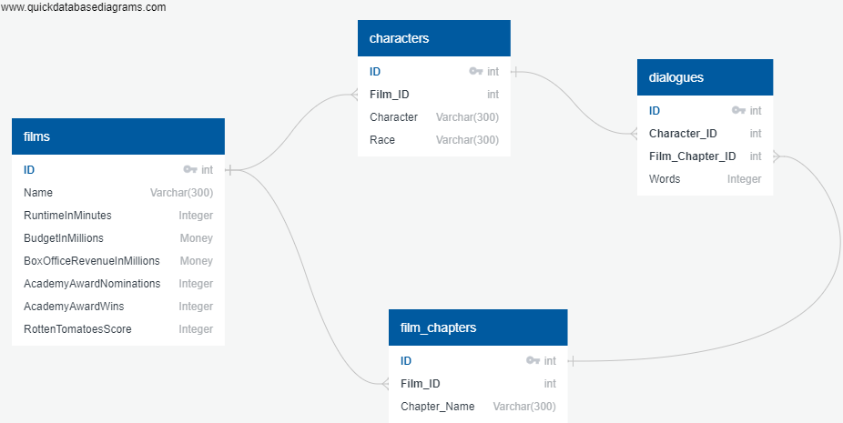
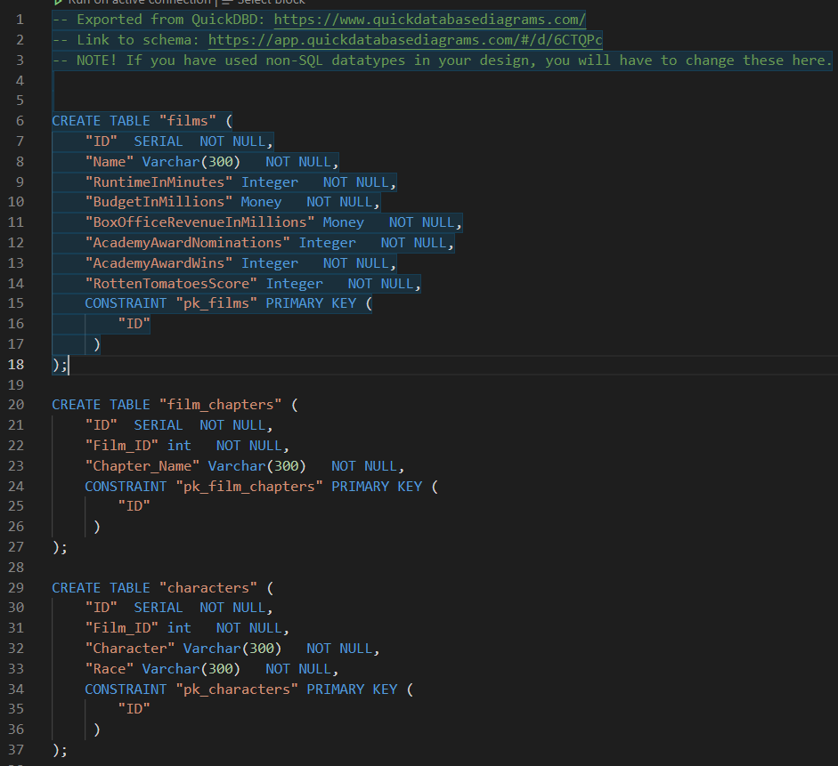

# ETL Project - Lord of The Ring DataBase
--------------------------------

## Introduction:

Extract, Transform and Load (ETL) is the general procedure of copying data from one or more sources into a destination system which represents the data differently from the source(s) or in a different context than the source(s). The ETL process became a popular concept in the 1970s and is often used in data warehousing. Click [Here](https://en.wikipedia.org/wiki/Extract,_transform,_load) to learn more about ETL.

For this project we explored the Lord of The Ring movie series and decided to build a postgresSQL data base that make it easy to access needed information about the movies, characters, chapters and dialogues. Movies data sets were downloaded from Kaggle and can be found here: [LOTR](https://www.kaggle.com/mokosan/lord-of-the-rings-character-data).

## ETL Work:

### 1- Extract: 

* Data in CSV files format was extracted from Kaggle [LOTR](https://www.kaggle.com/mokosan/lord-of-the-rings-character-data).
 
* Total of three seperate CSV files were doanloaded. Each file contain different information about the movies. 

### 2- Transform:

**Data Modeling:**

* Python, jupyter notebook and pandas were utilized to do data cleanup and add unique IDs to each data set.

* Build four tables. We used [QuickDBD](http://www.quickdatabasediagrams.com) website to sketch out an Entity Relationship Diagram (ERD) of the tables.

* Primary and Foreign keys were unitlized to build relations between tables.

#### SQL ERD

**Data Engineering:**

* Used the result from data modeling to create a table schema for each of the CSV files. 

* Specifing data types, primary keys, foreign keys, and other constraints.

#### Table Schema

   

### Load:

We used pgAdmin 4 and PostgresSQL to build and store our database.

  * Imported each CSV file into the corresponding SQL table.
  * Our DataBase is completed, we move to next phase.
  * We created tables in the correct order to handle foreign keys.

**Final database consist of four tables:**

1- Films: Contain informations about movie length, budget, awards and ratings.

2- Characters: Shows the movie characters and thier race.

3- Fila Chapters: Break the movies down into chapters similar to what the LOTR books show.

4- Dialogues: Here we put into a seperate table the words spoken by characters during the movie.

The way we created and relate our tables realy makes it very easy for a user to querry multible factors about the movies at  once. 

## Conclusion:
This was a fun project to do and it realy teach you a lot about data engineering and how to contruct a relational database. ETL work is widely utilized by many industries today and it is a big bounus to learn how to do it..

